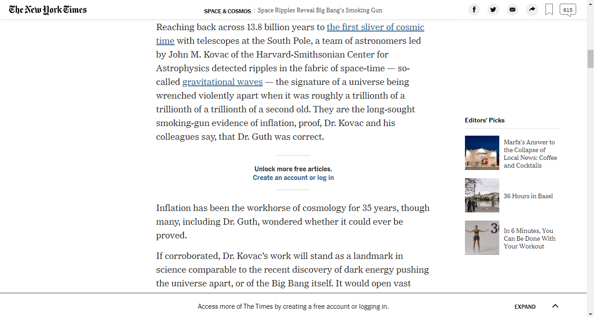

# New York Times Clone

> This is a clone of an article page from New York Times

The key concepts explored here are Flexbox, Grid and Float.

## Requirements

<ul>
  <h3>General</h3>
  <li>Add descriptive README file.</li>
  <li>Use meaningful names for your Pull Requests and add a short summary of its content.</li>
  <li>Use descriptive commit messages.</li>
  <li>Do not commit files that are not related to the project.</li>
  <li>Do not commit inline comments.</li>
</ul>

<ul>
  <h3>Specific</h3>
  <li>Align all elements with float and flex or grid.</li>
  <li>Use a code Linter</li>
  <li>Use Git and Github workflow</li>
  <li>Always commit</li>
  <li>Don't merge in master branch until the project finished and approved</li>
  <li>Use (aside) tag for Editor's picks section on the rightmost side.</li>
</ul>

## Built With

- Html5 and CSS3  
- Stickler-CI (Linter) and W3C validator  
- Git, Github and VScode  

## Live Demo

[Live Demo Link](https://sevlamare.github.io/new-york-times-clone/)

To get a local copy up and running follow these simple example steps.

## Getting Started

To get a local copy up and running follow these simple example steps.

### Prerequisites

If you don't want to follow the commits history skip this steps 
-Download Git at https://git-scm.com/downloads 
-Make a Github account and setup your SSH key in your current machine. 
-Clone the repository with terminal: 
git@github.com:SevlaMare/mint-sign-up-clone.git

### Setup

Click on green button in this page (Clone or download) and click on (Download Zip) 
Unzip de files. It's ready to use!

### Run

Just drag drop, the index.html on some web browser, like Google Crome.

## Authors

👤 **Haddad Sohaib**

- Github: [@githubhandle](https://github.com/HADDADSOHAIB)
- Twitter: [@twitterhandle](https://twitter.com/HaddadSohaib)
- Linkedin: [linkedin](https://www.linkedin.com/in/sohaibhaddad/)

👤 **Thiago Miranda**

- Github: [@githubhandle](https://github.com/SevlaMare)
- Twitter: [@twitterhandle](https://twitter.com/SevlaMare)
- Linkedin: [linkedin](https://www.linkedin.com/in/sevlamare)

## 🤝 Contributing

Contributions, issues and feature requests are welcome!

Feel free to check the [issues page](issues/).

## Show your support

Give a ⭐️ if you like this project!

## Acknowledgments

- A special thanks for the code reviewers

## 📝 License

This project is [MIT](lic.url) licensed.
